# HuaqingyuanjianTraining
## Day 1
### 练习git基本操作，同时将Pycharm与GitHub连接起来，
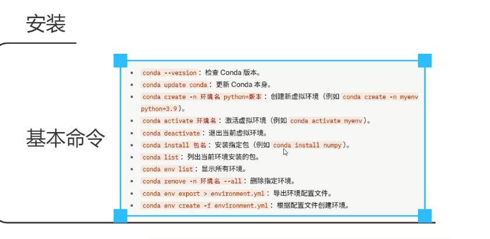
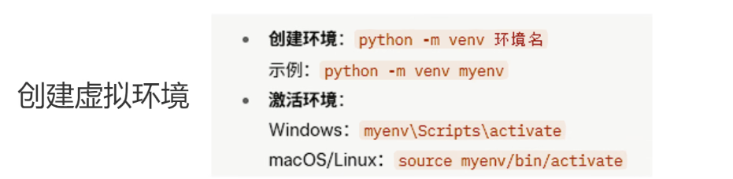
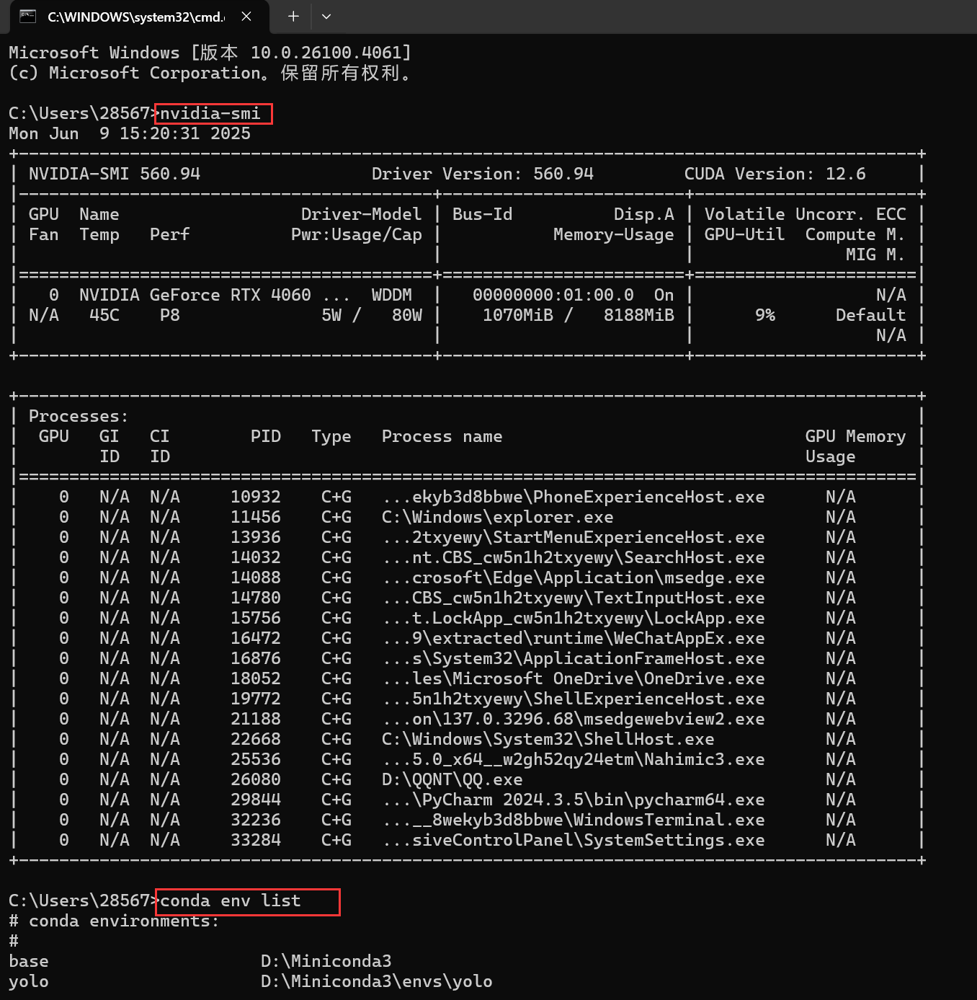

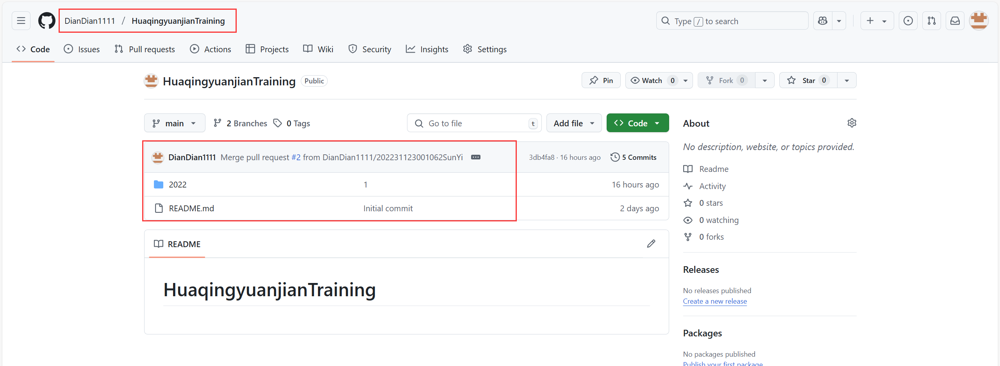
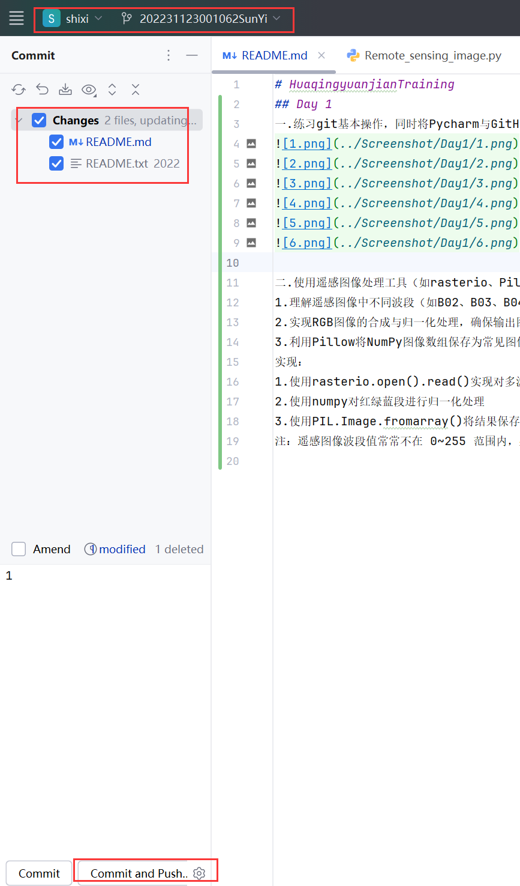
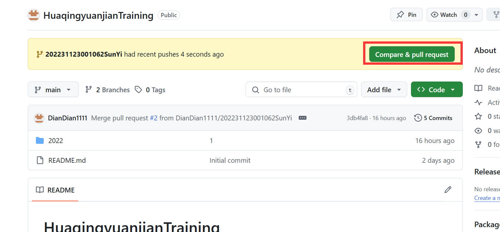


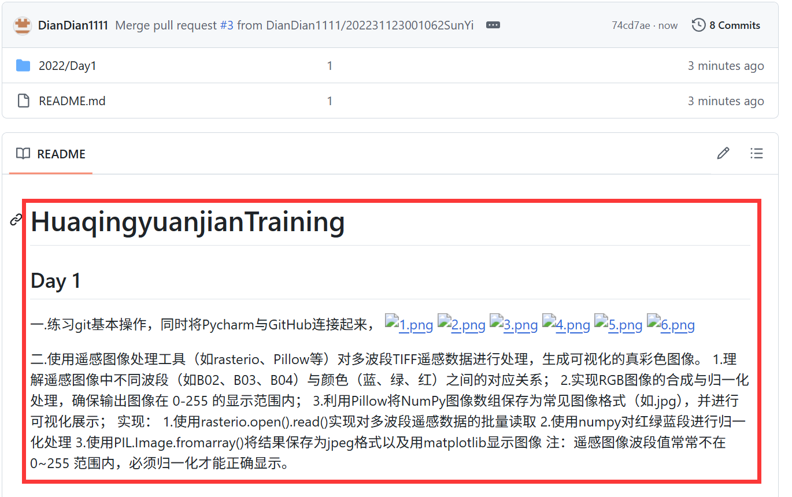
### 使用遥感图像处理工具（如rasterio、Pillow等）对多波段TIFF遥感数据进行处理，生成可视化的真彩色图像。
1.理解遥感图像中不同波段（如B02、B03、B04）与颜色（蓝、绿、红）之间的对应关系；
2.实现RGB图像的合成与归一化处理，确保输出图像在 0-255 的显示范围内；
3.利用Pillow将NumPy图像数组保存为常见图像格式（如.jpg），并进行可视化展示；
实现：
1.使用rasterio.open().read()实现对多波段遥感数据的批量读取
2.使用numpy对红绿蓝段进行归一化处理
3.使用PIL.Image.fromarray()将结果保存为jpeg格式以及用matplotlib显示图像
注：遥感图像波段值常常不在 0~255 范围内，必须归一化才能正确显示。


## Day2 深度学习与卷积神经网络（CNN）基础
### 1.深度学习基础
#### 1.1 深度学习训练流程
完整的训练流程包括：
1. **数据准备**：加载、预处理、划分训练与测试集；
2. **模型定义**：构建神经网络架构；
3. **损失函数**：衡量预测值与真实值差距；
4. **优化器**：更新权重以最小化损失；
5. **训练循环**（epoch）：反复迭代训练集；
6. **验证与测试**：评估模型泛化能力。
#### 1.2 欠拟合 vs 过拟合
| 类型     | 特征                               | 表现                                     |
|----------|------------------------------------|------------------------------------------|
| 欠拟合   | 模型能力不足                       | 训练集和验证集准确率都较低               |
| 过拟合   | 模型对训练数据记忆过强             | 训练准确率高，验证集准确率低             |
### 2.卷积神经网络（CNN）
CNN 是专门处理图像等网格数据的神经网络结构，广泛应用于图像识别、语音处理等任务。
#### 2.1 卷积层
**作用**：提取局部特征（如边缘、纹理等）  
**参数**：
- `in_channels`: 输入通道数（RGB图像为3）
- `out_channels`: 卷积核个数（输出通道）
- `kernel_size`: 卷积核大小（如3×3）
- `stride`: 步长
- `padding`: 边缘填充
**本质**：滑动窗口加权求和。
---
#### 2.2 激活函数
**常用函数**：
- `ReLU(x) = max(0, x)`：最常用，收敛快，计算简单；
- `Leaky ReLU`：缓解 ReLU 的“神经元死亡”；
- `Sigmoid / Tanh`：可能导致梯度消失，深层网络中使用较少。
---
#### 2.3 池化层
**作用**：降维、减少计算、防止过拟合  
**类型**：
- **最大池化**：取窗口最大值
- **平均池化**：取窗口平均值
**注意**：池化不改变通道数，只缩小宽高。
---
代码里面是最大池化，还有平均池化
[pooling_layer.py](2022/Day2/Fundamentals_of_Deep_Learning/pooling_layer.py)
代码示例
```python
from torch.nn import MaxPool2d

class Chen(nn.Module):
    def __init__(self):
        super().__init__()
        self.maxpool_1 = MaxPool2d(kernel_size=3, ceil_mode=False)

    def forward(self, input):
        return self.maxpool_1(input)

chen = Chen()
writer = SummaryWriter("maxpool_logs")

for data in dataloader:
    imgs, _ = data
    writer.add_images("input", imgs, step)
    output = chen(imgs)
    writer.add_images("output", output, step)
    step += 1
writer.close()
```
#### 2.4 批归一化（Batch Normalization）
**作用**：加速训练，缓解梯度消失  
**原理**：对每一层输入进行标准化（均值为0，方差为1）
---
#### 2.5 全连接层（Fully Connected Layer）
**作用**：将高维特征映射到最终分类结果  
**位置**：通常在卷积与池化层之后
---
#### 2.6 Dropout 层
**作用**：随机“丢弃”部分神经元，减少过拟合  
**原理**：每轮训练屏蔽一部分神经元输出
---
卷积过程[nn_conv.py](2022/Day2/Fundamentals_of_Deep_Learning/nn_conv.py)
#### 积运算的输出计算
5*5的输入数据 3*3的卷积核 步长1 填充1，输出5x5 
输出尺寸=⌊ N+2P−K /S ⌋+1
#### 图片卷积
[nn_conv2d.py](2022/Day2/Fundamentals_of_Deep_Learning/nn_conv2d.py)
#### 2.7 卷积操作示例（PyTorch）
```python
import torch
import torch.nn.functional as F

input = torch.tensor([[1,2,0,3,1],
                      [0,1,2,3,1],
                      [1,2,1,0,0],
                      [5,2,3,1,1],
                      [2,1,0,1,1]], dtype=torch.float32)
kernel = torch.tensor([[1,2,1],
                       [0,1,0],
                       [2,1,0]], dtype=torch.float32)

input = input.reshape(1, 1, 5, 5)
kernel = kernel.reshape(1, 1, 3, 3)

output = F.conv2d(input, kernel, stride=1)
output2 = F.conv2d(input, kernel, stride=2)
output3 = F.conv2d(input, kernel, stride=1, padding=1)
```
#### 2.8 卷CIFAR10 卷积网络示例
```python
import torch
import torchvision
from torch import nn
from torch.utils.data import DataLoader
from torch.utils.tensorboard import SummaryWriter

dataset = torchvision.datasets.CIFAR10(root="./dataset_chen", train=False,
                                       transform=torchvision.transforms.ToTensor())

dataloader = DataLoader(dataset, batch_size=64)

class CHEN(nn.Module):
    def __init__(self):
        super().__init__()
        self.conv1 = nn.Conv2d(3, 6, 3)

    def forward(self, x):
        return self.conv1(x)

chen = CHEN()
writer = SummaryWriter("conv_logs")

step = 0
for data in dataloader:
    imgs, _ = data
    output = chen(imgs)
    writer.add_images("input", imgs, step)
    output = output.reshape(-1, 3, 30, 30)
    writer.add_images("output", output, step)
    step += 1
```
### tensorboard使用
使用tensorboard命令打开
tensorboard --logdir= 自己的绝对路径
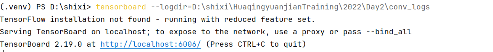
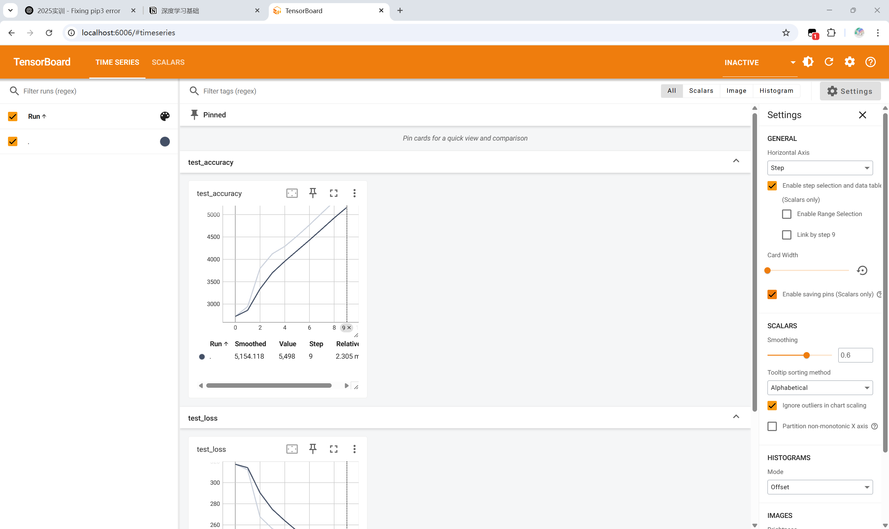


## Day3
### 1. 激活函数详解
[Activation_function.py](2022/Day3/Activation_function.py)
#### 1.1 激活函数的作用
激活函数用于神经网络中每个神经元的输出变换，具有以下作用：
- **引入非线性特性**：使神经网络能够逼近非线性映射；
- **影响学习能力**：决定每个神经元是否激活，控制信息传递；
- **提升表达能力**：增强神经网络对复杂数据分布的建模能力。
---
#### 1.2 常见激活函数
| 激活函数 | 特性描述 |
|----------|----------|
| **Sigmoid** | 输出范围 (0, 1)，适合概率输出。<br> 缺点：梯度消失、非零中心、计算复杂。 |
| **Tanh** | 输出范围 (-1, 1)，中心对称，表达能力强于 Sigmoid。<br> 缺点：梯度仍可能消失。 |
| **ReLU** | 计算快，收敛速度快，适用于多数 CNN 网络。<br> 缺点：存在“死亡神经元”问题。 |
| **Leaky ReLU** | 引入负区间小斜率 α，解决神经元失活问题。 |
| **PReLU** | 类似 Leaky ReLU，α 为可学习参数，更灵活。 |
| **ELU** | 负半轴更平滑，输出均值接近0，有助于收敛。<br> 但计算复杂度略高。 |
| **Swish** | 自适应激活，结合 Sigmoid 和 ReLU 优点。<br> 适用于高效网络结构（如 EfficientNet）。 |
| **Softmax** | 将向量归一化为概率分布，常用于多分类任务输出层。 |
---
#### 1.3 激活函数对比表
| 激活函数   | 输出范围     | 计算复杂度 | 梯度消失 | 是否需参数 | 应用场景 |
|------------|--------------|-------------|-----------|--------------|-----------|
| Sigmoid    | (0, 1)        | 高          | 有        | 否           | 二分类输出层 |
| Tanh       | (-1, 1)       | 高          | 有        | 否           | RNN / 零中心需求 |
| ReLU       | [0, ∞)        | 低          | 有        | 否           | 默认激活函数 / CNN |
| Leaky ReLU | (-∞, ∞)       | 低          | 无        | 是 (α)       | 深层网络 |
| PReLU      | (-∞, ∞)       | 低          | 无        | 是 (α 可学习) | CV任务 |
| ELU        | (-∞, ∞)       | 中          | 无        | 是 (α)       | 稳定收敛网络 |
| Swish      | (-∞, ∞)       | 高          | 无        | 是 (β)       | EfficientNet 等 |
| Softmax    | (0, 1) 且和为1 | 高          | 无        | 否           | 多分类输出层 |
---
### maganet
[moganet.py](2022/Day3/moganet.py)
### 训练自己的数据集
#### 数据预处理
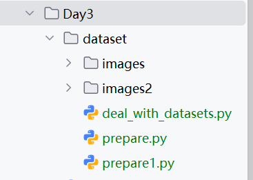
生成train文件和val文件
注意：需要备份一份数据集
然后在prepare.py中把train和val文件识别等得到train.txt和val.txt
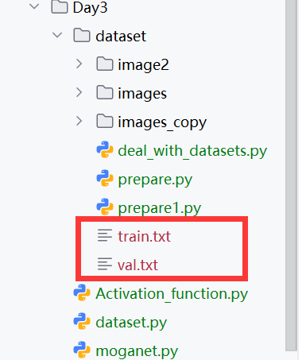


## Day4
### Transformer
时序版ViT
#### FeedForward前馈网络
```bash
class FeedForward(nn.Module):
    └─ LayerNorm(dim)
    └─ Linear(dim → hidden_dim)
    └─ GELU
    └─ Dropout
    └─ Linear(hidden_dim → dim)
    └─ Dropout
```
功能：Transformer 子层中的 MLP。
输入/输出：保持同维度 (b, n, d)。
LayerNorm在最前：这是一种 Pre-Norm 架构，先归一化再做子层运算，可稳定训练。
#### Attention（多头自注意力）
关键步骤（对每个 batch b）：
1. 归一化
```python
x = LayerNorm(x)                    # (b, n, d)
```
2. 线性映射到Q, K, V
```python
qkv = Linear(d → 3·h·d_head)        # (b, n, 3·h·d_head)
q, k, v = chunk(...).reshape(...)   # (b, h, n, d_head)
```
3. 注意力权重
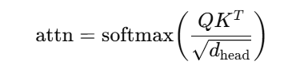得到形状 (b, h, n, n)。
4. 加权求和并重组
```python
out = (attn @ v)                    # (b, h, n, d_head)
out = rearrange → (b, n, h·d_head)  # (b, n, d)
out = Linear(d → d) + Dropout
```
project_out：当 h·d_head ≠ d 才需要再映射回 d，否则直接 Identity()。
#### Transformer（层堆叠）
```python
for _ in range(depth):
    x = Attention(x) + x   # 残差
    x = FeedForward(x) + x # 残差
```
depth=6（示例中）：堆叠 6 个 Attention-FFN 子层。
输入/输出维度不变 (b, n, d)。
#### ViT主体
1. Patch Embedding
```python
Rearrange('b c (n p) -> b n (p c)', p=patch_size)
```
假设输入序列形状 (b, c, seq_len)。
patch_size=16：把时间维按步长 16 切成 n = seq_len // 16 个 patch。
patch_dim = c × patch_size（示例里 3 × 16 = 48）。
之后用 LayerNorm → Linear(patch_dim → d) → LayerNorm 将每个 patch 投影到模型维 d=1024，得到 (b, n, d)。
2. 加入 CLS token 与位置编码
```python
cls_token = Parameter(d)          # (d,)
cls_tokens = repeat(cls_token, 'd -> b d', b=b)  # (b, d)
x, ps = pack([cls_tokens, x], 'b * d')           # (b, n+1, d)
x += pos_embedding[:, :n+1, :]                   # 可学习的位置编码
```
pack / unpack：einops 的辅助函数，方便把可变长度序列“打包/拆包”并保留索引信息。
位置编码：可学习参数 (1, n+1, d)，同ViT原论文。
3. Transformer 编码器
```python
x = self.transformer(x)  # (b, n+1, d)
```
4. 分类头
```python
cls_tokens, _ = unpack(x, ps, 'b * d')  # 取出第一位 CLS
logits = LayerNorm → Linear(d → num_classes)
```
输出形状 (b, num_classes)，可直接接CrossEntropyLoss做分类。
5. main
```python
v = ViT(
    seq_len=256, patch_size=16,    # 256 / 16 = 16 个 patch
    num_classes=1000,
    dim=1024, depth=6, heads=8,
    mlp_dim=2048,
    dropout=0.1, emb_dropout=0.1
)

time_series = torch.randn(4, 3, 256)  # (batch=4, channels=3, length=256)
logits = v(time_series)               # 输出 (4, 1000)
```
### yolo训练自己的数据集
#### 学习重要参数设置
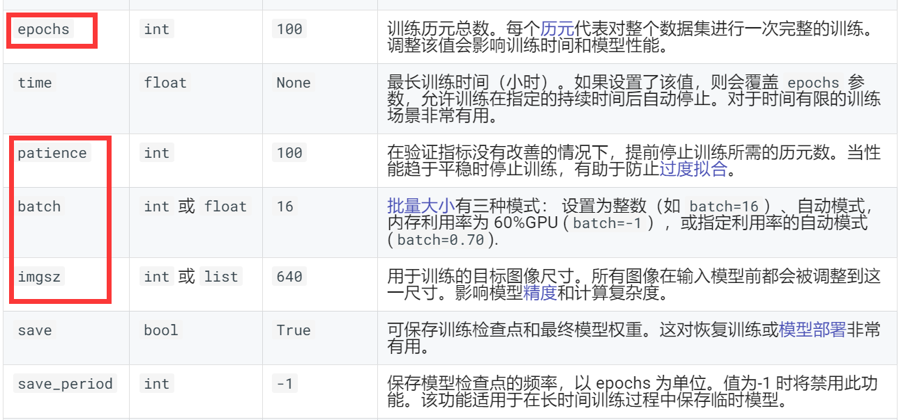
#### 训练预加载数据集
新建train.py以后，选择yolo模型的训练文件
#### 1. `train.py` 逐行解析
```python
from ultralytics import YOLO               # ① 引入 Ultralytics 高级 API

model = YOLO("yolov8n.yaml")               # ② 用 Nano 配置文件创建空模型
model = model.load("yolov8n.pt")           # ③ 加载同系列的预训练权重

model.train(                               
    data="coco8.yaml",  # ④ 数据集配置（8-类 COCO 子集示例）
    imgsz=60,           # ⑤ 输入分辨率，边长=60 px
    epochs=20,          # ⑥ 训练 20 轮
    batch=16            # ⑦ 每批次 16 张图
)
```
① YOLO 类 — Ultralytics 封装的统一接口（检测 / 分割 / 分类）。
② yolov8n.yaml — 网络结构与超参定义文件。Nano 版参数最少、速度最快。
③ .load() — 把官方发布的权重 yolov8n.pt 挂载到上一步创建的拓扑中，得到“带预训练权重的 Nano”。这种“YAML+PT”联合用法已在官方 ISSUE 中给出建议。
④ data — 指向数据集 YAML。里面包含 train/val 图像路径及类别列表。
⑤–⑦ 关键超参 — 全部可在 model.train() 中修改；文档列出了完整列表
#### 2. 训练流程概览
解析 YAML → 加载图片与标签。
DataLoader → 按 batch 采样并缩放到 imgsz。
前向-后向传播 → 计算损失，反向梯度更新。
评估与日志 → 每轮在验证集评估 mAP，输出到终端和 TensorBoard。
Checkpoints → 每轮把权重 & 结果保存到 runs/detect/ 子目录。
#### 常用超参与调优
| 参数              | 说明                    | 何时调整    |
| --------------- | --------------------- | ------- |
| `imgsz`         | 输入尺寸，越大越准但显存占用更高      | 分辨率低时上调 |
| `epochs`        | 训练轮数                  | 数据集小可增加 |
| `batch`         | 批大小                   | 显存充裕时上调 |
| `learning_rate` | 基础学习率（在 YAML 或 CLI 中） | 微调新数据集  |
| `project/name`  | 自定义输出目录               | 区分实验    |
#### 重点看results.png的图片
presion精度：预测正确的框的个数和预测所有的框的比值
recall召回率：预测的框个数和我们标签框个数的比值
iou交并比：预测的框和我们真实的框 交集和并集的面积之比
map50：交并比在0.5的所有框的精度的平均值，用来评价模型的预测的综合能力
map50-95：是用来评估模型精准预测的能力
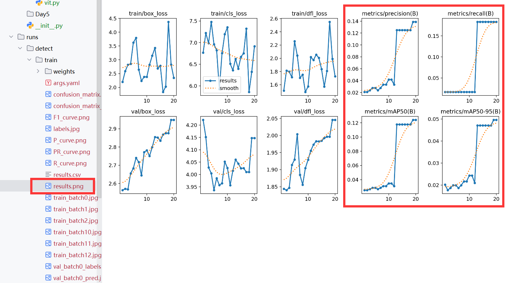

## Day5
### 交通标志训练
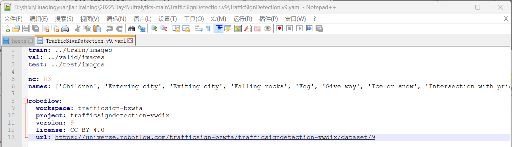
ranfficSignDetection.v9.yaml和我们的coco数据集的格式有区别
```python
lst = ['Children', 'Entering city', 'Exiting city', 'Falling rocks', 'Fog', 'Give way', 'Ice or snow', 'Intersection with priority', 'Intersection without priority', 'Level crossing -multiple tracks-', 'Level crossing 160m', 'Level crossing 240m', 'Level crossing 80m', 'Level crossing with barriers ahead', 'Level crossing without barriers ahead', 'Level crossing', 'Loose surface material', 'Low-flying aircraft', 'No heavy goods vehicles', 'No left turn', 'No overtaking by heavy goods vehicles', 'No right turn', 'No vehicles carrying dangerous goods', 'No vehicles', 'One-way street', 'Opening bridge', 'Parking zone', 'Pedestrian crossing', 'Pedestrians', 'Priority over oncoming traffic', 'Right curve', 'Road narrows', 'Roadworks', 'Series of curves', 'Slippery surface', 'Soft verges', 'Steep ascent', 'Steep descent', 'Traffic queues', 'Traffic signals', 'Trams', 'Tunnel', 'Two-way traffic', 'Unprotected quayside or riverbank', 'Wild animals', 'ahead only', 'ahead or right', 'bumpy road', 'crosswalk', 'do_not_enter', 'end ofSpeed limit 70', 'general caution', 'keep right', 'left curve', 'no admittance', 'no overtakes', 'no stopping', 'no_parking', 'priority road', 'road work', 'roundabout', 'slippery road', 'speed limit -100-', 'speed limit -110-', 'speed limit -120-', 'speed limit -130-', 'speed limit -20-', 'speed limit -30-', 'speed limit -40-', 'speed limit -5-', 'speed limit -50-', 'speed limit -60-', 'speed limit -70-', 'speed limit -80-', 'speed limit -90-', 'stop', 'traffic light- green', 'traffic light- red', 'trafic light- red', 'turn left orright only', 'turn right only', 'yellow', 'yield']

for i, item in enumerate(lst):
	print(f"  {i}: {item}")
```
写代码将yaml配置文件更改成coco数据集格式，然后更改我们的模型配置文件，类别为83
然后更改路径
### 训练自己制作的数据集
1。划分数据集
```python
import os
import shutil
from sklearn.model_selection import train_test_split
import random
import copy

# 设置数据文件夹路径
gray_dir = "./images"
label_dir = "./labels"

# 获取image和label文件夹中的所有文件名
gray_files = os.listdir(gray_dir)
label_files = os.listdir(label_dir)

# 确保image和label文件夹中的文件数量相同
assert len(label_files) == len(gray_files), "Number of image and labels files must be t he same!"

# 将文件名组合为一个列表
# label_files = copy.copy(gray_files)
# for i in range(len(label_files)):
#     label_files[i] = label_files[i].replace(".jpg", ".txt")

files = list(zip(gray_files, label_files))
random.shuffle(files)

# 划分数据为训练集和测试集（这里还包括验证集，但你可以根据需要调整比例）
train_files, temp_files = train_test_split(files, test_size=0.3, random_state=42)  # 假设30%为测试集
valid_files, test_files = train_test_split(temp_files, test_size=0.5, random_state=42)  # 剩下的50%中，再取50%为验证集
print("测试集长度：" + str(len(test_files)))
print("训练集长度：" + str(len(train_files)))
print("验证集长度：" + str(len(valid_files)))

# 创建目录（如果它们不存在）
for split in ['train', 'test', 'val']:

    os.makedirs(os.path.join(gray_dir, split), exist_ok=True)
    os.makedirs(os.path.join(label_dir, split), exist_ok=True)

# 移动文件到相应的目录
def move_files(file_list, split):
    for gray, lbl in file_list:

        shutil.move(os.path.join(gray_dir, gray), os.path.join(gray_dir, split, gray))
        shutil.move(os.path.join(label_dir, lbl), os.path.join(label_dir, split, lbl))

move_files(train_files, 'train')
move_files(valid_files, 'val')
move_files(test_files, 'test')

print("Data split completed!")
```
运行deal_with_datasets.py文件之后，新建数据yaml配置文件
```python
import os
# 最后一步:生成数据集的train.txt val.txt test.txt

def write_file_paths_to_txt(directory, output_file):
    with open(output_file, 'w') as f:
        for root, dirs, files in os.walk(directory):
            for file in files:
                file_path = os.path.join(root, file)
                f.write(file_path + '\n')

            # 调用函数，为每个文件夹写入文件路径

write_file_paths_to_txt(r'D:\ultralytics-main\datasets_cups\images\\train', 'train.txt')
write_file_paths_to_txt(r'D:\ultralytics-main\datasets_cups\images\\test', 'test.txt')
write_file_paths_to_txt(r'D:\ultralytics-main\datasets_cups\images\\val', 'val.txt')
```
## Day6
### 绘制yolo算法流程图
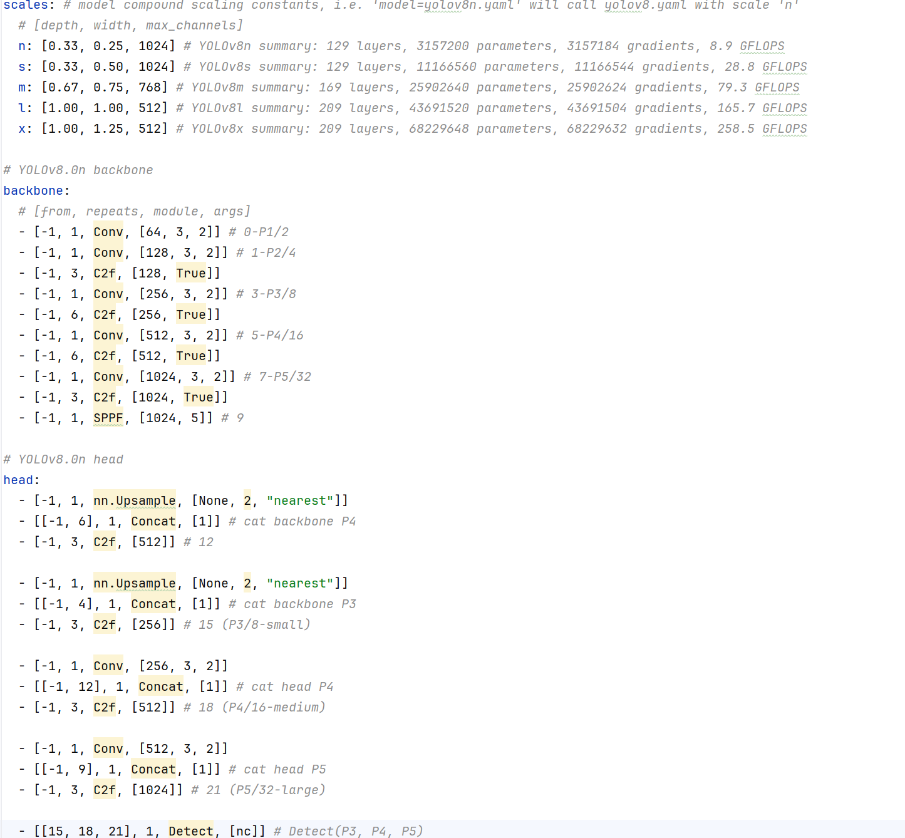
yolov8.yaml文件作用：
* 定义模型的层次结构（Conv、C2f、SPPF 等）
* 配置不同规模模型的 深度（depth）、宽度（width） 和 最大通道数
* 指明哪些特征图参与最终检测输出（如 P3、P4、P5）
#### 统一结构定义、便于模型构建和训练：
通过 YAML 格式结构化配置，使得模型结构的定义更加清晰、灵活，便于程序自动构建网络。
利用 scales 字段，可以通过简单修改 "model=yolov8n.yaml" 来加载不同规模（n/s/m/l/x）的模型。
#### 多尺度检测支持：
定义了 P3/8、P4/16、P5/32 三个输出特征图，分别对应小、中、大目标检测，提升模型的检测精度和适应性。
#### 模块化、可扩展：
每层结构使用 [from, repeats, module, args] 格式统一描述，便于修改、调试和扩展。
分离 backbone 和 head 使得网络结构更加模块化。
#### scales 参数 - 代表模型复用深度、宽度因子、最大通道数，用于控制模型大小和速度-精度权衡。
```python
scales:
  n: [0.33, 0.25, 1024]  # YOLOv8n
```
#### backbone 主干网络（特征提取） - Backbone 提取原始图像的多层次特征。
```python
backbone:
  - [-1, 1, Conv, [64, 3, 2]]   # 第0层: 卷积层，输出64通道，3x3卷积核，步长2
  - [-1, 3, C2f, [128, True]]   # C2f 是类似CSP的残差结构，用于增强特征表达
  - ...
  - [-1, 1, SPPF, [1024, 5]]    # 最后是 SPPF 模块，用于扩大感受野
```
#### head 检测头（多尺度融合 + 检测） - Head 融合不同尺度的特征图，并执行目标检测任务（输出框的位置和类别）。
```python
head:
  - [-1, 1, nn.Upsample, [None, 2, "nearest"]]  # 上采样
  - [[-1, 6], 1, Concat, [1]]                  # 和 backbone 的 P4 特征图拼接
  - ...
  - [[15, 18, 21], 1, Detect, [nc]]            # 多尺度特征进行目标检测
```
#### 相关模块简要说明
| 模块         | 作用说明                                 |
| ---------- | ------------------------------------ |
| `Conv`     | 卷积层（卷积 + BN + SiLU激活）                |
| `C2f`      | 类似 CSP 的残差结构，增强特征提取能力                |
| `SPPF`     | Spatial Pyramid Pooling - Fast，扩大感受野 |
| `Concat`   | 通道拼接，用于特征融合                          |
| `Upsample` | 上采样，用于恢复空间分辨率                        |
| `Detect`   | 检测模块，输出边框和类别预测                       |

### yolov8流程图 vs yolov12流程图
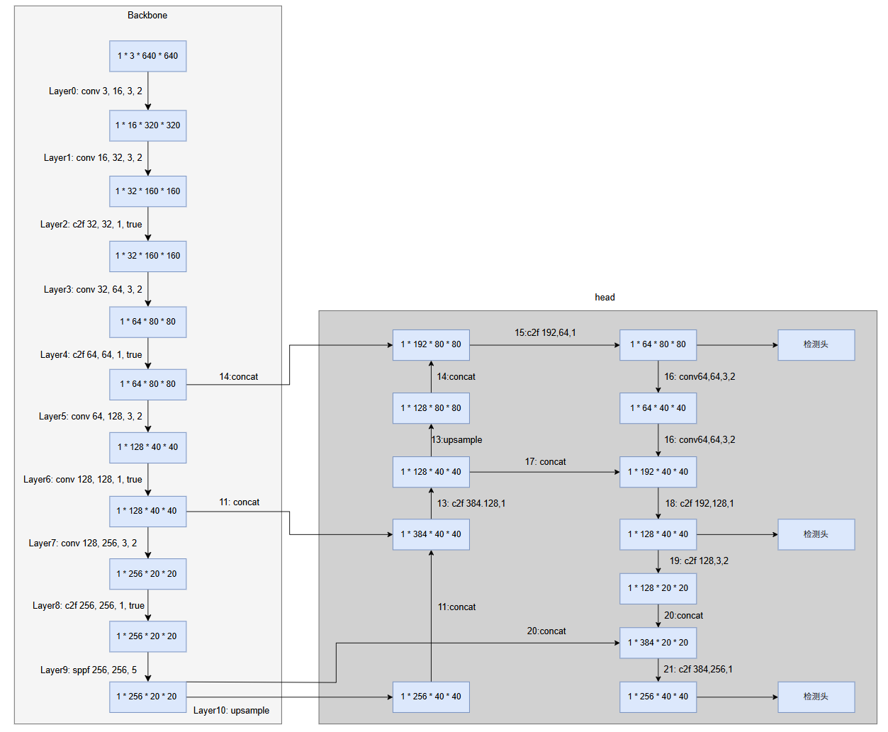

### YOLOv8 与 YOLOv12 算法对比分析
#### 一、模型架构对比
##### YOLOv8 架构特点：
- **Backbone 主干网络**：基于 CNN 的结构，采用 C2f 模块（类似 CSP）提升特征重用。
- **SPPF 模块**：改进的空间金字塔池化（Spatial Pyramid Pooling-Fast），增强感受野。
- **Head 检测头**：使用解耦头部（Decoupled Head）分别预测类别与边框。
- **结构风格**：轻量、模块化，适合快速推理部署。
##### YOLOv12 架构创新：
- **Backbone 主干网络**：结合 CNN 与轻量级 Vision Transformer（如 LightViT 或 MobileOne）。
- **Neck 中间融合结构**：采用 Query-based attention（QFormerNeck），具备更强的上下文建模能力。
- **Head 检测头**：增强的解耦结构，集成动态标签分配器（DynamicSoftLabelAssigner）。
- **整体设计理念**：将 Transformer 优势引入检测，面向复杂环境与多任务统一建模。
#### 二、核心功能与模块对比
| 功能模块             | YOLOv8 描述                                         | YOLOv12 描述                                               |
|----------------------|------------------------------------------------------|--------------------------------------------------------------|
| 主干网络             | C2f 卷积结构                                         | CNN + 轻量 Transformer                                     |
| 特征融合（Neck）     | 上采样 + Concat（类 PANet）                          | QFormerNeck 注意力融合                                     |
| 检测头（Head）       | 解耦式预测头                                         | 动态标签解耦头，支持软标签分配                             |
| Transformer 模块     | ❌ 不使用                                            | ✅ 使用轻量 Transformer 构建上下文                         |
| 标签分配机制         | TaskAlignedAssigner（基于 IoU 的动态分配）         | DynamicSoftLabelAssigner（软标签赋权）                      |
| 多尺度检测           | P3/8、P4/16、P5/32 三层检测                          | 同样支持多尺度，额外增强对小目标检测能力                   |
| 支持部署             | ✅ ONNX、TensorRT、CoreML、TFLite                    | ✅ 更依赖 GPU 推理，适合云端部署                            |
| 输入图像尺寸         | 灵活，默认 640x640                                   | 推荐 640~1024 之间变换，多分辨率自适应                     |
#### 三、COCO 数据集性能对比（val2017）
| 模型名称       | 推理速度（640x640） | 参数量 | mAP@0.5 | mAP@0.5:0.95 |
|----------------|----------------------|--------|----------|--------------|
| YOLOv8n        | ~150 FPS（RTX 3090） | 3.2M   | ~50.2%   | ~34.0%       |
| YOLOv8m        | ~100 FPS             | 25M    | ~53.9%   | ~37.0%       |
| YOLOv12-nano   | ~130 FPS             | 5.1M   | ~54.2%   | ~36.8%       |
| YOLOv12-base   | ~85 FPS              | 28M    | ~57.8%   | ~39.5%       |
> 说明：
> - YOLOv12 在相似参数下精度高于 YOLOv8；
> - 推理速度略有下降，但仍适用于多数实时任务；
> - Transformer 的引入提高了对小目标、遮挡目标的识别能力。
#### 🎯 四、算法创新点总结（YOLOv12）
| 创新点 | 描述说明 |
|--------|----------|
| 🔸 混合主干网络 | 使用 MobileNet 或 MobileOne 与 LightViT 构建 CNN-Transformer 混合结构，兼顾精度与速度。 |
| 🔸 混合主干网络 | 使用 MobileNet 或 MobileOne 与 LightViT 构建 CNN-Transformer 混合结构，兼顾精度与速度。 |
| 🔸 Query Attention Neck | 模拟 Transformer 中 Query-Value-Key 的机制，提升不同尺度间特征融合效果。 |
| 🔸 动态软标签机制 | 引入 DynamicSoftLabelAssigner，自适应地为训练样本分配更合理的标签权重，提高训练稳定性。 |
| 🔸 更强小目标检测 | 全局建模能力使得 YOLOv12 在遮挡、远景目标检测中表现更优。 |
#### 五、应用场景推荐
| 场景类型               | 推荐算法版本 |
|------------------------|---------------|
| 移动端或边缘设备部署   | YOLOv8n/s     |
| 实时视频监控系统       | YOLOv8m/l     |
| 城市交通 / 安防场景    | YOLOv12-base  |
| 复杂环境 / 小目标检测  | YOLOv12-large |
| 多任务（检测+分割+姿态） | YOLOv12-unified |
#### 六、参考文献与链接
- 🔗 [Ultralytics YOLOv8 官网文档](https://docs.ultralytics.com/)
- 🔗 [YOLOv12 GitHub 仓库（WongKinYiu）](https://github.com/WongKinYiu/yolov12)
- 🔗 [YOLOv12 论文（arXiv 2025）](https://arxiv.org/abs/2404.xxxxx)
#### 七、总结
YOLOv8 在部署效率和工程友好性方面依然具备很强竞争力，是主流轻量级检测模型的代表。而 YOLOv12 作为未来发展方向之一，充分融合 Transformer 与检测框架，显著提升了模型的泛化能力与检测精度，尤其适合复杂环境与多任务学习。
根据具体项目需求，可选择合适版本：
- 若追求 **极致速度** ➜ 使用 YOLOv8；
- 若追求 **精度与多任务融合** ➜ 使用 YOLOv12。


